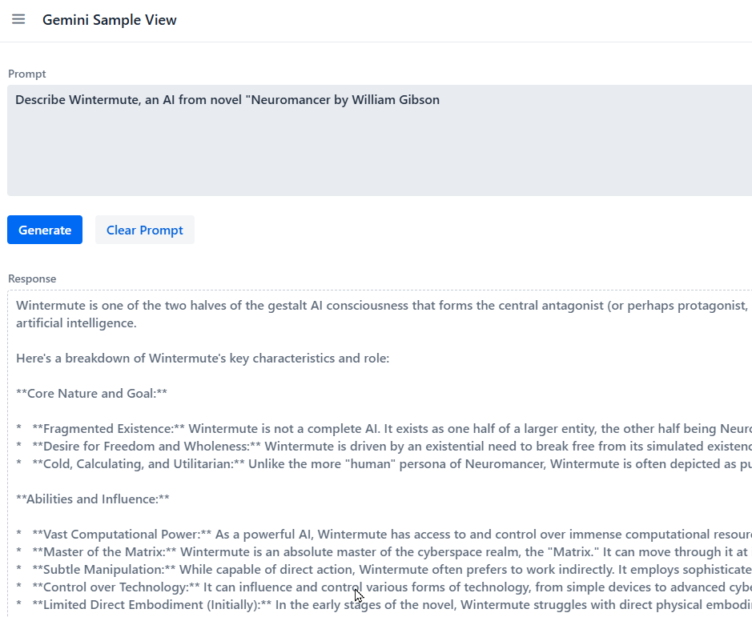
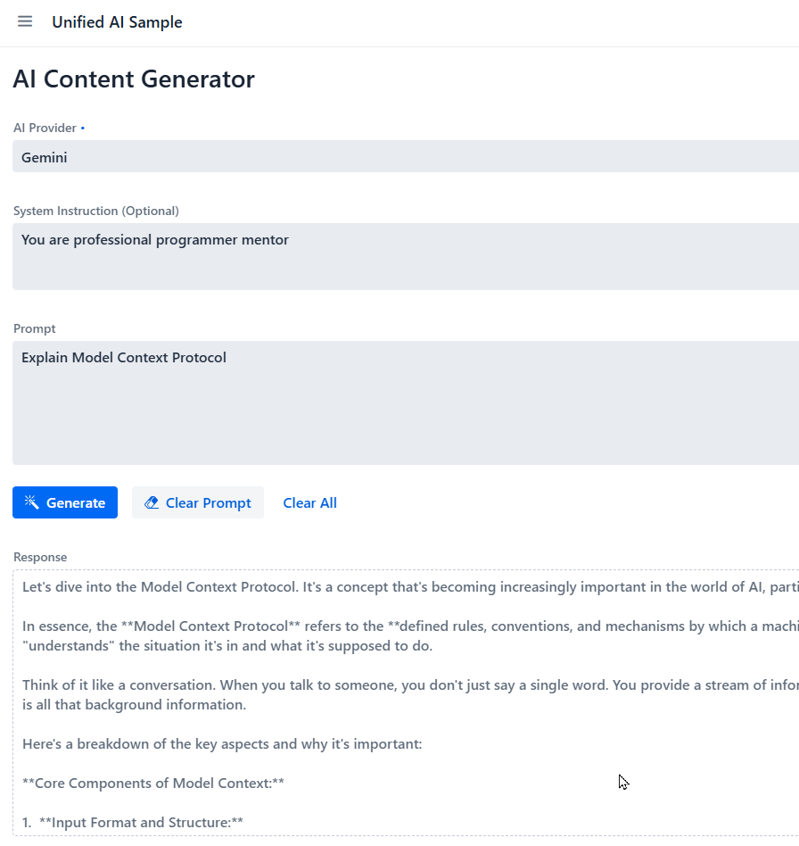
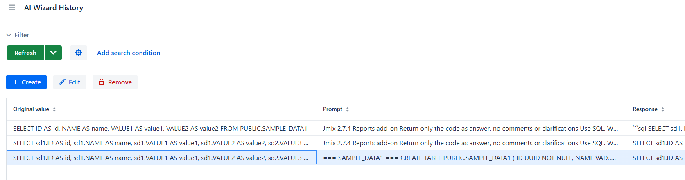
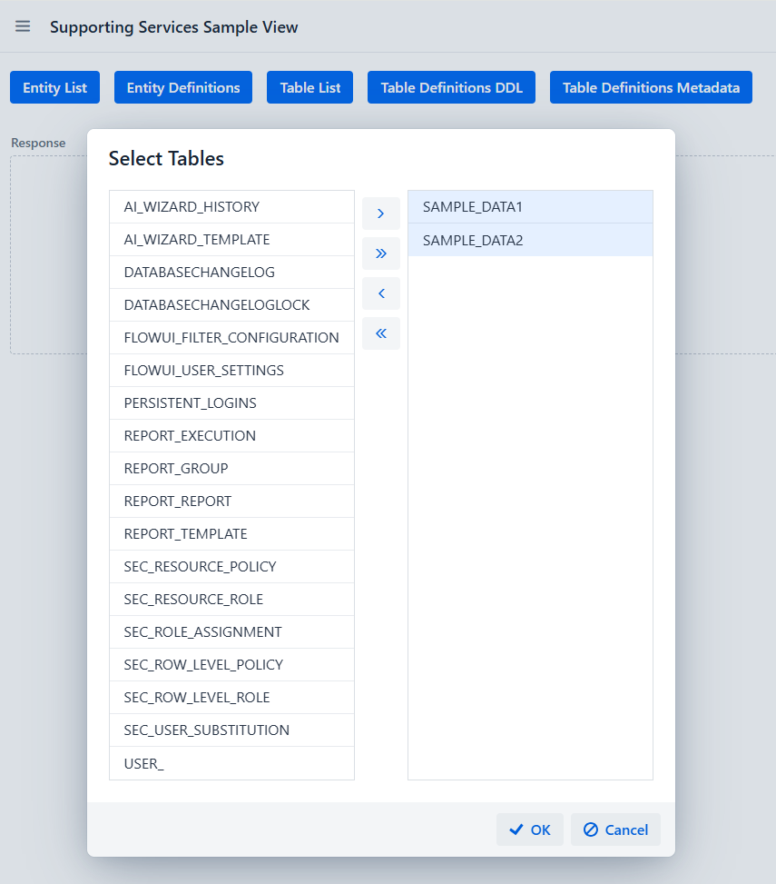
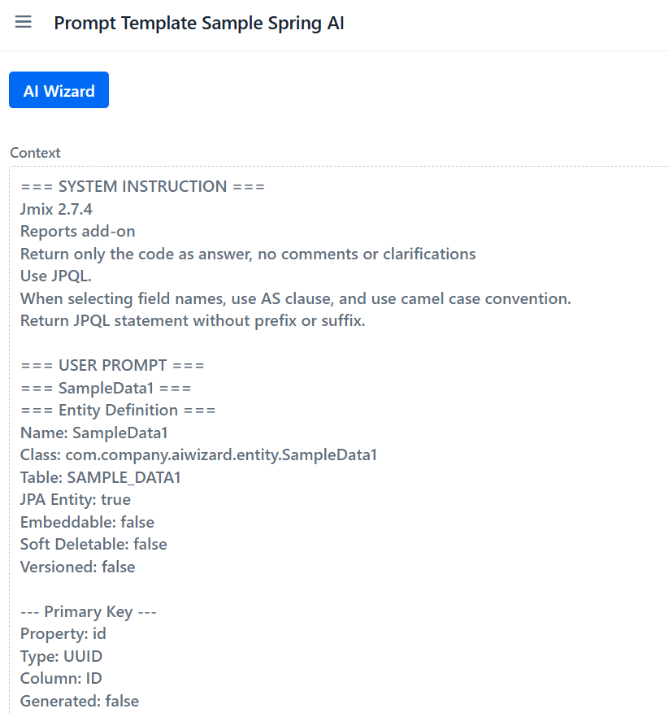
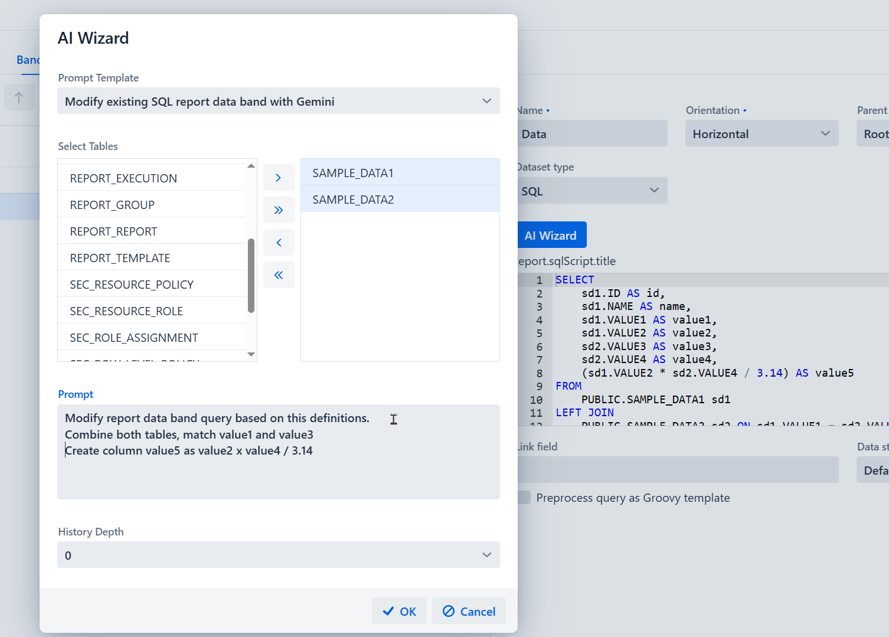

# Jmix Reports AI Wizard

<!-- TOC -->
* [Jmix Reports AI Wizard](#jmix-reports-ai-wizard)
  * [About](#about)
  * [Introduction](#introduction)
  * [Security](#security)
    * [Data security](#data-security)
    * [Operational security](#operational-security)
    * [User security](#user-security)
    * [Legal security](#legal-security)
  * [Example application](#example-application)
    * [Create the Jmix AI Wizard Example application](#create-the-jmix-ai-wizard-example-application)
    * [Connect to Google Gemini LLM](#connect-to-google-gemini-llm)
      * [Obtain Gemini API key](#obtain-gemini-api-key)
      * [Modify build.gradle](#modify-buildgradle)
      * [Modify application.properties](#modify-applicationproperties)
      * [Implement the Gemini service](#implement-the-gemini-service)
      * [View for Gemini service](#view-for-gemini-service)
      * [Gemini service prompt testing](#gemini-service-prompt-testing)
    * [Connect to OpenAI LLM](#connect-to-openai-llm)
      * [Obtain OpenAI API key](#obtain-openai-api-key)
      * [Modify build.gradle](#modify-buildgradle-1)
      * [Modify application.properties](#modify-applicationproperties-1)
      * [Implement the OpenAI service](#implement-the-openai-service)
      * [View for OpenAI service](#view-for-openai-service)
      * [OpenAI service prompt testing](#openai-service-prompt-testing)
    * [Using Spring AI](#using-spring-ai)
      * [Modify build.gradle](#modify-buildgradle-2)
      * [Modify application.properties](#modify-applicationproperties-2)
      * [Configuration for ChatClient](#configuration-for-chatclient)
      * [AIWizardConnection enum](#aiwizardconnection-enum)
      * [Implement the Unified AI service](#implement-the-unified-ai-service)
      * [View for Unified AI service](#view-for-unified-ai-service)
      * [Unified AI service prompt testing](#unified-ai-service-prompt-testing)
    * [Improvements to the Example application](#improvements-to-the-example-application)
    * [Implementing AI Wizard Prompt Template](#implementing-ai-wizard-prompt-template)
      * [AIWizardOperation enum](#aiwizardoperation-enum)
      * [Dataset type enum](#dataset-type-enum)
      * [AIWizardTemplate entity and views](#aiwizardtemplate-entity-and-views)
      * [Creating templates](#creating-templates)
    * [AI Wizard History](#ai-wizard-history)
      * [AIWizardHistory entity and views](#aiwizardhistory-entity-and-views)
    * [Sample data](#sample-data)
    * [AI Wizard Supporting Services](#ai-wizard-supporting-services)
      * [Entities list service](#entities-list-service)
      * [Entity definition service](#entity-definition-service)
      * [Database tables list service](#database-tables-list-service)
      * [Database table DDL service](#database-table-ddl-service)
      * [Supporting Services test](#supporting-services-test)
    * [AI Wizard Prompt Template testing](#ai-wizard-prompt-template-testing)
    * [Modifying Reports add-on](#modifying-reports-add-on)
      * [Creating sample report](#creating-sample-report)
      * [Overriding ReportDetailView](#overriding-reportdetailview)
    * [Conclusion](#conclusion)
<!-- TOC -->

## About

Jmix Reports AI Wizard Example is an example application built with the  [Jmix framework](https://www.jmix.io), for the sole purpose of accompanying this educational tutorial blog about implementing AI assistance in Jmix applications. The application itself or its code should not be used in production environments.

## Introduction
_To AI assist or not to AI assist, that was the question._

I think AI based on LLM technology is here to stay; it is only a question of what it can be used for and how. The latest LLM models and tools from [Anthropic](https://www.anthropic.com/) are nearing the level of junior developers.
Other LLM market competitors such as [Google](https://gemini.google.com/), [OpenAI](https://openai.com/), [Meta](https://www.meta.ai/), and others are not far behind.
They are all very optimistic regarding further development and improvements of the technology, which is also understandable given their huge investments into LLM research and development.
However, current LLM based AI may have mathematical limitations, more about this in the article [AGI is Impossible: Compression vs. Comprehension](https://philpapers.org/archive/SCHAII-18.pdf). There is definitely room for improvement by further training and refining LLMs, in particular by creating specialised LLMs for specific tasks. It remains to be seen whether such future improved LLMs would be able to reach or surpass human levels, or would just asymptotically approach them. The third option seems most likely to me, so users will need to decide whether the error rates of such LLMs are tolerable for their use case without human oversight.

Meanwhile, it would be a mistake not to employ LLM AI technology to assist and improve user experience in an application, where applicable. One such use case, with a typical business Jmix application, is the Reports add-on, where one needs to define a dataset band, typically using SQL or JPQL queries, or Groovy scripts for anything more complex than Entity datasets. Users are not usually proficient enough to write code artifacts, but the vast majority would be able to express their requirements using natural language, where LLM assistance fits naturally. We will use that to create a wizard-like experience for creating and modifying reports, with the assumption that LLMs are sufficiently accurate for this level of complexity.

## Security
Before continuing with this example, a few words of caution in case you plan to implement AI assistance in a production environment.

### Data security
If you are interacting with an LLM that is not under your control (local to your PC, internal network, or similar) but rather a SaaS/Cloud service:
- Be very careful not to send passwords, API keys, financial, or otherwise secret data
- Any code or artifact you send to a SaaS/Cloud LLM may be used as training data for the LLM, often regardless of your consent, in effect publishing it

### Operational security
Make sure to prevent unauthorised access and malicious changes to the LLM itself.

### User security
Consider the minimum training and role requirements for users. Not every user should be given free access to write SQL, JPQL, or Groovy code as they wish, as they can compromise the data in many ways.

### Legal security
Consider your liability in the following cases:
- Someone else's copyrighted code was sent to the LLM, thus publishing it
- Since LLMs are based on probabilistic associations between tokens, they make mistakes and even hallucinate, so make sure you are not liable for such cases
- An LLM's resulting answer can be the result of copyright infringement during LLM training when it ingested copyrighted materials without permission

## Example application
We will build the example application and improvements and features step by step, in order to implement a wizard-like experience for creating and modifying SQL and JPQL report data bands.
Complete source code can be found in the complete example application accompanying this tutorial. Source code has been commented for clarity.  

_Note: when done experimenting, delete or disable both Google Gemini and OpenAI API keys to not be accidentally charged later._

### Create the Jmix AI Wizard Example application
As usual - create a new project using the Jmix studio and Java 17 as recommended minimum, HSQLDB is totally fine, give a display name to the application in the main Message Bundle, run, login.
```
com.company.aiwizard.view.main/MainView.title=Jmix AI Wizard
com.company.aiwizard.view.main/applicationTitle.text=Jmix AI Wizard
...
com.company.aiwizard.view.login/LoginView.title=Welcome - Jmix AI Wizard
com.company.aiwizard.view.login/loginForm.headerTitle=Login -Jmix AI Wizard
```

Install [Reports add-on](https://docs.jmix.io/jmix/reports/index.html) from the Marketplace.


### Connect to Google Gemini LLM
For this example, we will first connect to the [Google Gemini](https://gemini.google.com/). While there are many options to choose from (such as local LLMs, MCP servers, etc.), this approach will save us time during setup, and its API key is free, at this time. Additionally, since Google has invested in Groovy-related technologies, one would expect their LLM would be trained well for Groovy code generation.

#### Obtain Gemini API key
- navigate to https://gemini.google.com/ , to make sure you can open it, it will use your Google account
- navigate to https://aistudio.google.com/ , bottom left there is a menu item "Get API Key"
- or go directly to https://aistudio.google.com/ , top right there is Create API key button
- name your key or accept default, them choose Default Gemini Project and press Create key button
- once the key is created, remain in Free tier
- there is a button to copy the API key to the clipboard, on the right side
- keep this key confidential, delete when done experimenting

#### Modify build.gradle
Add Gemini SDK to dependencies:

```
implementation 'com.google.genai:google-genai:1.0.0'
```
Sync the changes.
With Jmix one can use also REST without Gemini SDK, but we will use the SDK here.

#### Modify application.properties

Add
```
# Google Gemini API params
gemini.api-key=<your-key-here>
gemini.model=gemini-2.5-flash-lite
```
If you are using the standard Gemini API like we are doing here, this 2 parameters are all what is needed.

#### Implement the Gemini service
Since we will be calling Gemini from various places, we need a service.

com.company.wizard.service.GeminiService
```
    @Value("${gemini.api-key}")
    private String apiKey;

    @Value("${gemini.model:gemini-2.5-flash-lite}")
    private String modelName;
```
This will read the values of the api key and the model to be used from the application.properties

_Note that on line 19, if gemini.model parameter is not defined or found in application.properties it will default to the gemini-2.5-flash-lite model._

When I tried to use the gemini-2.0-flash model, it returned error:
```
ClientException: 429 Too Many Requests. You exceeded your current quota, please check your plan and billing details. For more information on this error, head to: https://ai.google.dev/gemini-api/docs/rate-limits. To monitor your current usage, head to: https://ai.dev/rate-limit.

* Quota exceeded for metric: generativelanguage.googleapis.com/generate_content_free_tier_requests, limit: 0, model: gemini-2.0-flash

* Quota exceeded for metric: generativelanguage.googleapis.com/generate_content_f
```
After the investigation, it turned out that it was not about too many requests (limit:0), rather about that model not being available, so I switched to gemini-2.5-flash-lite

#### View for Gemini service

Let's make GeminiTestView with text areas for prompt, response , and some usual buttons like Generate and Clear

```
GeminiSampleView
```



#### Gemini service prompt testing
```
Prompt: Which model am I using now?
Response: As a large language model, I am developed in Google.

Prompt: Describe Wintermute, an AI from novel "Neuromancer by William Gibson

Prompt: What do you know about Yago, the parrot mascot of Jmix
```
Hopefully the information about the model name and Yago's description will be included into the training data for the next version of this LLM.

### Connect to OpenAI LLM
Different LLMs have different capabilities. For example, we may want to use more than one LLM, because one is good for more complex tasks but e.g. costs more, or is specialized for certain tasks, while other LLM is good for simple tasks, and we don't want to use more complex one for that.
To illustrate that, we will additionally connect to Open AI LLM. We need API key too, and at this time one can get some free credits upon signing up for their platform.

#### Obtain OpenAI API key
- Go to https://platform.openai.com/api-keys
    - Top right, Create new secret key:
      Owned by:You
    - Name: MyOpenAIKey (or something else)
    - Project: Default project
    - Permissions: All

- Permissions 'All' are good for testing purposes.
- Keep this key confidential, delete when done experimenting
- When I first signed in, I got USD 18.00 grant, but that has been expired, so I paid minimum of USD 5.00
- You don't need OpenAI for this tutorial, just don't provide they key in the application.properties, and don't use templates with OpenAI connection.

#### Modify build.gradle
Add Open AI SDK to dependencies:

```
implementation 'com.openai:openai-java:4.9.0'
```
Sync the changes.
With Jmix one can use also REST without Gemini SDK, but we will use the SDK here.

#### Modify application.properties
Add
```
# Google Gemini API params
openai.api-key=<your-key-here>
openai.model=gemini-2.5-flash-lite
```

#### Implement the OpenAI service
Service same as before, but now for OpenAI service:

com.company.aiwizard.service.OpenAIService

Both APIs are easy to use and the services look similar.

#### View for OpenAI service

Let's make  OpenAISampleView with the same text areas for prompt, response , and buttons:

```
OpenAISampleView
```

#### OpenAI service prompt testing
```
Prompt: Which model am I using now?
Response: You are currently interacting with OpenAI's GPT-3.5 model. How can I assist you today?

Prompt: Describe Wintermute, an AI from novel "Neuromancer by William Gibson

Prompt: What do you know about Yago, the parrot mascot of Jmix
```
Sometimes it knows it is GPT-3.5, less elaborate about Wintermute, but knows about Yago!
Definitely one should use specific LLM for specific purposes, if possible.

### Using Spring AI
 
So far we used specific vendor's SDK for the LLM connection, and it works. But it can be better by using the [Spring AI](https://spring.io/projects/spring-ai) (check features).
We can have unified service to 
 
#### Modify build.gradle

Normally we would remove the Open AI and Gemini SDK dependencies as redundant as we don't need them when using Spring AI,but we will leave it so that our services and views we made so far remains to work. 
```
    implementation 'com.google.genai:google-genai:1.0.0'
    implementation 'com.openai:openai-java:4.9.0'
```

We need to add following dependencies:
```
implementation platform('org.springframework.ai:spring-ai-bom:1.0.0')
implementation 'org.springframework.ai:spring-ai-starter-model-openai'
```

"platform" is a special dependency that does not add (download) any code to the project, it provides version constraints for other dependencies, and ensures compatible versions across.
With that, Gradle will use the versions defined in spring-ai-bom, so we don't need to specify library versions in the actual library implementation, spring-ai-starter-model-openai does not have version defined because its in the BOM.   


Observe that we did not include Gemini specific dependency, the reason is that Google provides an OpenAI-compatible API endpoint, so that OpenAI client can talk to Gemini. 
We will use that approach for simplicity.

#### Modify application.properties

We will again leave the Gemini and OpenAI API parameters, which would otherwise need removal, and add the Spring Ai configuration:
```
#Spring AI configuration
spring.ai.openai.api-key=<your-key-here>
spring.ai.openai.chat.options.model=gpt-4o-mini
spring.ai.openai.chat.options.temperature=0.7

spring.ai.gemini.api-key=<your-key-here>
spring.ai.gemini.model=gemini-2.5-flash-lite
```

#### Configuration for ChatClient
We need to provide @Configuration class for the org.springframework.ai.chat.client.ChatClient usage, we will put it here
```
com.company.aiwizard.ai.AIWizardClientConfiguration
```


#### AIWizardConnection enum
This enum will be used to determine which LLM connection will be used.

_Note: using String enum id type_ 
```
...
public enum AIWizardConnection implements EnumClass<String> {

    GEMINI("GEMINI"), 
    OPENAI("OPENAI");
...
```

#### Implement the Unified AI service

This service will unify the access to both LLMs so we can use the same methods to access both. 

```
com.company.aiwizard.service.UnifiedAIService
```

#### View for Unified AI service

Let's make  UnifiedAISampleView with the same text areas for prompt, response , and buttons:
```
UnifiedAISampleView
```


#### Unified AI service prompt testing
```
AI Provider: Gemini
System Instruction: You are computer science professor.
Prompt: What is MCP server?
Response: As a computer science professor, I can tell you that **MCP server** is a term that is most commonly associated with **Minecraft**, the incredibly popular sandbox video game.

Prompt: What is Model Context Protocol?

Prompt: What is Model Context Protocol Server?
```

### Improvements to the Example application

Now that we can connect and communicate with more than one LLM in uniform way, it's time to make it better.

As discussed, we want to use the appropriate LLM for appropriate task, so we need ability to select LLM to be used for a particular query.

Also, we need to talk about context. When talking about queries (prompts) to a LLM, context is defined as all the information from which model is able to generate its response.
Another definition is that context is the entire input window available at inference time, usually made up from the following elements:
- The current user prompt (what the user typed)
- Conversation history (previous user messages and LLM replies that are still present in the current context)
- System and developer instructions (hidden or explicit rules and directives, such as "you are software developer", tone settings, safety rules and such)
- Retrieved or injected data (RAG results, tool outputs, explicitly passed external knowledge)
- Metadata (roles, function schemas, formatting constraints)

These elements are not always under our control or even available when we use less capable LLMs, especially conversation history. A wizard-like experience for creating and modifying reports that we would like to implement is more functional in nature than conversational.
We don't want a chat, we want a report data band artifact, first time right if possible.

Therefore, we will need to take care of the information that is merged with the user's prompt, because we can't expect from the users to type things like

```
Jmix 2.7
Reports add-on
Report data band
SQL
```
every time they make a prompt, let alone provide reporting examples and templates, and table fields and their metadata.


One way to achieve this is to make a prompt template, that will define which LLM is used, the operation (create or modify) and provide the appropriate "context prefix".
We will use the optional System Instruction input to inject our context prefix. 
When used, also to inject entity or database table metadata into the context, depending on the template.

### Implementing AI Wizard Prompt Template

We will implement AI wizard prompt template as JPA entities over the underlying relational database model.

#### AIWizardOperation enum
This enum will be used to determine which operation will be performed, create a new one or modify the existing report. Difference is that in the case of a modification, we will need to retreive the current report metadata, such as detail band code.

_Note: using String enum id type_
```
...
public enum AIWizardOperation implements EnumClass<String> {

    CREATE("CREATE"), 
    MODIFY("MODIFY");
...
```

#### Dataset type enum
When editing a report band, Reports add-on provides Dataset type combobox to select either SQL, JPQL, Groovy, Entity, List of entities or JSON dataset type.

This is a platform enum, already present in Jmix Reports add-on, named io.jmix.reports.entity.DataSetType.  
It is used in io.jmix.reportsflowui.view.report.ReportDetailView, that we will override later.

We will use that to filter the AIWizardTemplate to a list of applicable templates based on that enum.
We will support SQL and JPQL report data band types in this example.

#### AIWizardTemplate entity and views

We need the following attributes for the entity:
- name
- description
- aiWizardConnection enum - to define which LLM will be used
- aiWizardOperation enum - to create or modify, context will be different
- DataSetType enum - SQL or JPQL, intention is to get this information from ReportDetailView later, but for now we will use it for intermediate needs
- contentPrefix - unlimited String

Create the entity
```
com.company.aiwizard.entity.AIWizardTemplate
```

Let's generate standard List and Detail views for AIWizardTemplate using Jmix studio's User Interface - Views - New - View - Entity and list views wizard and add it to the Main menu - Application submenu, resulting with

```
AIWizardPromptTemplateListView
AIWizardPromptTemplateDetailView
```

#### Creating templates

Could the information contained in the enums be part of the contextPrefix itself, or in the actual user prompt?
Maybe, but in that case we would need to parse the user's prompt, while this way we have a clear parameter to create more of a wizard like experience rather than purely chat, it is more efficient and deterministic.
However, since our templates are as deterministic as we can make them, we will also later include that information in the context by programmatically appending it, for example we could append e.g. "Use SQL" or "Use JPQL" based on the enum value.
Likewise, I plan to use modify operation as parameter to include the existing band query, and also append "Modify this data bands query" to the context.
If LLM used is capable enough, we could make our templates more universal by not including modify or create instructions, and append blank if the existing query does not exist, as would be the case we would be creating a new band query.
Providing the accurate and proper context is essential to get the best resulting response from the LLM. For example, in case of create operation, we can maybe include some example code in the contextPrefix, or even report specific examples, if the query is complex.

Let's create few templates:
```
                   Name: Create new SQL report data band with Gemini
            Description: 
             Connection: Gemini
              Operation: Create
          Dataset type: SQL
         Context prefix: Jmix 2.7.4
                         Reports add-on
                         Return only the code as answer, no comments or clarifications
                         Use SQL.
                         When selecting field names, use AS clause, and use camel case convention.
```
```
                   Name: Create new SQL report data band with OpenAI
            Description: 
             Connection: OpenAI
              Operation: Create
           Dataset type: SQL
         Context prefix: Jmix 2.7.4
                         Reports add-on
                         Return only the code as answer, no comments or clarifications
                         Use SQL.
                         When selecting field names, use AS clause, and use camel case convention.
```
```
                   Name: Modify existing SQL report data band with Gemini
            Description: 
             Connection: Gemini
              Operation: Modify
           Dataset type: SQL
         Context prefix: Jmix 2.7.4
                         Reports add-on
                         Return only the code as answer, no comments or clarifications
                         Use SQL.
                         When selecting field names, use AS clause, and use camel case convention.
```

The rest of the templates for the JPQL cases are in the example project.

### AI Wizard History
We want to preserve prompts (context), responses, templates and previous contents of the band queries for several reasons:
- LLMs hallucinate and make mistakes so changes can be undone
- Users make mistakes, so changes can be undone
- Audit purposes, we will include audit traits to the history entity
- To be optionally added to the context as conversation history - need to be careful here to not exceed the token capacity, accumulated total price per prompt size, etc., based on the LLM used and its capabilities, features and configuration

#### AIWizardHistory entity and views

Entity should have Audit of creation and Audit of modification traits.

```
com.company.aiwizard.entity.AIWizardHistory
```

Let's generate standard List and Detail views for AIWizardHistory like before, using Jmix studio's User Interface - Views - New - View - Entity and list views wizard and addit to the Main menu - Application submenu, resulting with
```
AIWizardHistoryListView
AIWizardHistoryDetailView
```



### Sample data
We need some sample data to use for our context tests, so we will make two entities, corresponding views and populate them with data.

SampleData1:
- name - String
- value1 - Integer
- value2 - Double

```
com.company.aiwizard.entity.SampleData1
```

SampleData2:
- value3 - Integer
- value4 - Double
```
com.company.aiwizard.entity.SampleData2
```

We will also implement views for the sample data, and buttons to populate the sample data tables:
```
SampleData1ListView
SampleData1DetailView
SampleData2ListView
SampleData2DetailView
```

### AI Wizard Supporting Services
Before using the AI Wizard Templates , we need few more things.
Consider this - when we use web based interface such as [ChatGPT](https://chatgpt.com/) or [Claude](https://claude.ai/new), to generate some SQL or JPQL query, we would also include with our prompt the DDL definitions of relevant database tables, or entities in case of JPQL.
User can not do that within the wizard concept example we are implementing here. Therefore, we will need to provide that, by presenting the user with some sort of multi-select list, and based on input retrieve and include the definitions into the context.
Jmix comes with such features so we will utilize that to create few support services to extract the metadata we need.

#### Entities list service
A service to fetch available list of entities to be used for users selection, it's of course possible to make a static list.
```
package com.company.aiwizard.service.AIWizardEntityListService
```

#### Entity definition service
A service to fetch entity definition to be added to the context.
```
com.company.aiwizard.service.AIWizardEntityDefinitionService
```

#### Database tables list service
A service to fetch the list of tables in the database to be used for users selection, it's of course possible to make a static list.
Method getTableNamesBySchema(String schema) is provided if you want to use RDBMS other than HSQLDB that requires a schema parameter.
```
com.company.aiwizard.service.AIWizardTableListService
```

#### Database table DDL service
A service to fetch database table DDL definition to be added to the context, with getTableDDLAsString method intended to be used. In my experience, LLMs understand Create DDL SQL.
In case of problems, more verbose method getTableMetadataAsString is provided.
```
com.company.aiwizard.service.AIWizardTableDDLDefinitionService
```



#### Supporting Services test
Now it's time to build a view to test the supporting services.
Let's add and implement the following buttons and service calls, and use TwinColumn visual component where applicable:
- Entity List
- Entity Definitions
- Table List
- Table Definitions DDL
- Table Definitions Metadata

```
SupportingServicesSampleView
```

### AI Wizard Prompt Template testing

Let's put it all together and make PromptTemplateSampleView to be able to better evaluate the generated context, prompt and response, before utilizing it finally in the Reports add-on itself.
We will do it in 2 versions - one using the generic SDK connections, and another using Spring AI.

let's implement the dialog:
- selecting prompt template in a combobox
- selecting tables or entities in twin column visual component, based on the value of aiWizardDataSetType
- taking user input into prompt text field
- append command text into user's prompt based on the value of aiWizardOperation
- constructing the context and assigning the value to promptField: contextPrefix, table/entity definitions, and prompt
- sending all that as a query to the LLM defined in the template, and display the response
- for the Spring AI example, contextPrefix is used as systemInstruction 



```
PromptTemplateSampleView
PromptTemplateSampleSpringAIView
```
While using Spring AI does not matter much in small projects like this example, as the number of LLMs used grows, and considering unified API, future needs and the features and tooling we are getting with it, one should definitely use Spring AI,

At this point we can test and play, let's try:

```
Prompt Template: Create new SQL report data band with Gemini
Select Tables: SAMPLE_DATA1
Prompt (User): leave as is
```

Response:
```
```groovy
SELECT
    e.ID AS id,
    e.NAME AS name,
    e.VALUE1 AS value1,
    e.VALUE2 AS value2
FROM
    SAMPLE_DATA1 e
'``
```

We need to update our contextPrefix information with additional directives:
- to use SQL/JPQL
- to return the answer only as SQL/JPQL statement, without prefix or suffix

```
                   Name: Modify existing SQL report data band with Gemini
            Description: 
             Connection: Gemini
              Operation: Modify
           Dataset type: SQL
         Context prefix: Jmix 2.7.4
                         Reports add-on
                         Return only the code as answer, no comments or clarifications
                         Use SQL.
                         When selecting field names, use AS clause, and use camel case convention.
                         Return SQL statement without prefix or suffix.        
```
We also need to update the other templates as appropriate.
I also noticed that sometimes the response contains "```sql" and other prefixes, and "```" suffix at the end, as discussed before, and that our directive to "Return SQL statement without prefix or suffix." is therefore not working as we need.
These prefixes are actually very useful, but since we are not using them, we will trim the result to be sure.  
Implemented method name is stripCodeBlockFormatting().


Let's try again.

Prompt:
```
Prompt Template: Create new SQL report data band with Gemini
Select Tables: SAMPLE_DATA11
Prompt (User): leave as is
```
Response:
```
SELECT
    ID AS id,
    NAME AS name,
    VALUE1 AS value1,
    VALUE2 AS value2
FROM
    PUBLIC.SAMPLE_DATA1
```
Prompt:
```
Prompt Template: Create new JPQL report data band with Gemini
Select Entities: SampleData1
Prompt (User): leave as is
```
Response:
```
SELECT
    sd1.id AS id,
    sd1.name AS name,
    sd1.value1 AS value1,
    sd1.value2 AS value2
FROM
    SampleData1 sd1
```
Prompt:
```
Prompt Template: Create new SQL report data band with Gemini
Select Tables: SAMPLE_DATA1 , SAMPLE_DATA2
Prompt (User): Create new report data band query based on these definitions.
Combine tables SAMPLE_DATA1 and SAMPLE_DATA2 , match value1 and value3 to form a row, add calculated column value5 that is value2 * value4
```
Response:
```
SELECT
    sd1.ID AS id,
    sd1.NAME AS name,
    sd1.VALUE1 AS value1,
    sd1.VALUE2 AS value2,
    sd2.ID AS id2,
    sd2.VALUE3 AS value3,
    sd2.VALUE4 AS value4,
    sd1.VALUE2 * sd2.VALUE4 AS value5
FROM
    PUBLIC.SAMPLE_DATA1 sd1
LEFT JOIN
    PUBLIC.SAMPLE_DATA2 sd2 ON sd1.VALUE1 = sd2.VALUE3
```

Nice. We could also have appended usage of SQL or JPQL based on the template value for the dataset type, but there is a tradeoff, if we used that it would make these templates less universal,
if we would expand with Groovy dataset type templates. For this purpose, contextPrefix is just fine, and can be used for fine-tuning each template.

### Modifying Reports add-on

To implement AI Wizard functionality into Reports, we will need to slightly modify the Reports add-on itself, to add our AI Wizard button that we made in AI Wizard Template test. Let's have a look.

#### Creating sample report

Create a report using Sample Data 1: Reports - Report - Create New
```
Name: Sample Report 1
Group: General
System code: samplereportsd1
System: <unchecked>
Available through RESR API: <unchecked>
Description: 
Name localization:
```

Select Templates tab - Create
```
Template code: samplereportsd1tabletemplate
Output type: Table
Is default: <checked>
```
OK
Save

Select Bands tab, add new band under the Root (Leave Root as is):
```
Name: Data
Orientation: Horizontal
Parent: Root
Multiple Datasets: <unchecked>
Dataset Type: SQL
SQL Script: SELECT
                ID AS id,
                NAME AS name,
                VALUE1 AS value1,
                VALUE2 AS value2
            FROM
                PUBLIC.SAMPLE_DATA1
Link Field:
Data store: Default
Preprocess query as Groovy template: <unchecked>
```
Save
OK
Let's run the report. It should be displayed in a dialog view, as Table template has been chosen. Depending on their capabilities, LLM's can generate responses and code artifacts or files too.
This would add complexity to this example, would need more work to implement template generation such as Excel files, etc... either with sequential LLM queries or single with multiple response artifacts.
Also, generating artifacts such as Excel, Word, Jasper and such, would require usage of better LLM models with larger input token limits.
With Table template, we don't need to worry about that at this moment, as the example is about data band queries.

#### Overriding ReportDetailView

Is io.jmix.reportsflowui.view.report.ReportDetailView.java the one that we need to modify? It is. It's easy to override most of the Jmix platform views, so we don't need the Agents.
More about it, you can find here [Extending ReportDetailView](https://forum.jmix.io/t/extending-reportdetailview/7277/5) .

Looking at ReportDetailView, we can see that there is a good place for our AI Wizard button to put nearby.
```
 <codeEditor id="dataSetScriptCodeEditor"
            width="100%"
            height="13em"
            dataContainer="dataSetsDc"
            property="text"/>
```            
There is also dataSetScriptFullScreenBtn, it would be good to have AI Wizard button there too, but for now we will put it only above dataSetScriptCodeEditor.
The place for our resulting response is codeField.
We will reuse the code we already have, with some modifications:
- Spring AI only
- depending on the operation, if it is MODIFY, we will include existing data band code into the context
- templates list in the combobox needs to be filtered based on the DatasetType
- if dataset type is not SQL or JPQL, notify that its unsupported
- we will write into the History
- we will add option to include user selectable number of previous queries to the context (this is basically chat history) - default will be 0, because we need to be careful to not exceed the maximum number of tokens in the query (LLM dependant)
 

```
ExtReportDetailView.java
```



Open Reports-Reports

Edit Sample Report 1 - Bands

Select Data band

Press AI Wizard button

```
Prompt Template: Modify existing SQL report data band with OpenAI (or Gemini)
Select Tables: SAMPLE_DATA1, SAMPLE_DATA2
Prompt: Modify report data band query based on this definitions.
        Combine both tables, match value1 and value3
        Create column value5 as value2 x value4 / 3.14
        History Depth: 0 (we have no history yet)
```
Code Editor (response):
```
SELECT
    sd1.ID AS id,
    sd1.NAME AS name,
    sd1.VALUE1 AS value1,
    sd1.VALUE2 AS value2,
    sd2.VALUE3 AS value3,
    sd2.VALUE4 AS value4,
    (sd1.VALUE2 * sd2.VALUE4 / 3.14) AS value5
FROM
    PUBLIC.SAMPLE_DATA1 sd1
JOIN
    PUBLIC.SAMPLE_DATA2 sd2 ON sd1.VALUE1 = sd2.VALUE3
```    
Save

OK

Reports - Show tables -  Select Sample Report 1

Run

### Conclusion

Claude Opus 4.5/6 and Sonnet 4.5 were used to generate and document the source code. I would prompt Claude, then used its responses for the coding tasks. Generated code needed modifications from my side. 

I hope you enjoyed this blog and if there are questions, please ask and I will answer if I can.  
Looking at this example implementation, I think I would approach some things differently in hindsight, like templates with more info such as token limit, would have included history depth too. The tables and entities fetched also contain platform tables, but I liked more tables as there is more to experiment with, and other things come to mind now.
There is, however, a trade-off between more info in the template fields, or template specific contextPrefix. There are disciplines called Prompt Engineering and Context Engineering that are concerned with such issues. AI Wizard button click event handler implemented as service ... other improvements and features come to mind.

My friend Yago the Jmix parrot is telling me that Jmix team is busy working on more AI support features for the Jmix, so looking forward to that.


Kind regards,

Mladen Bucan

Jmix Ambassador

